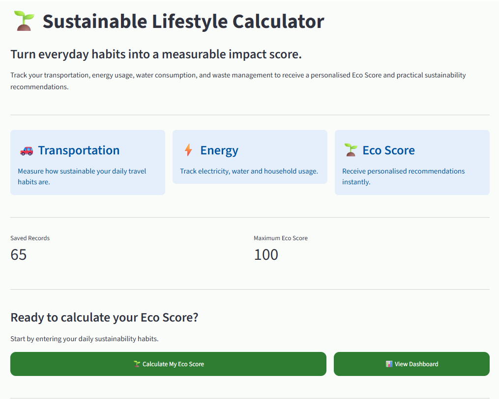
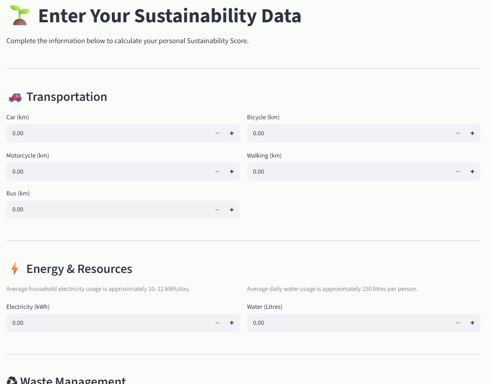
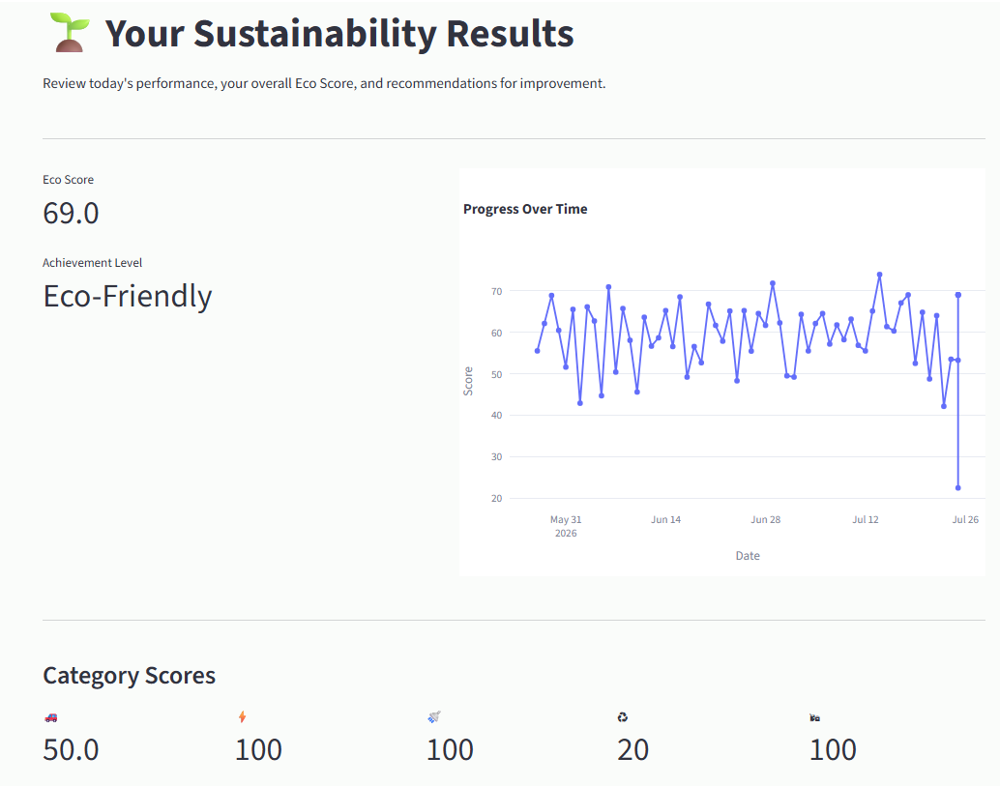
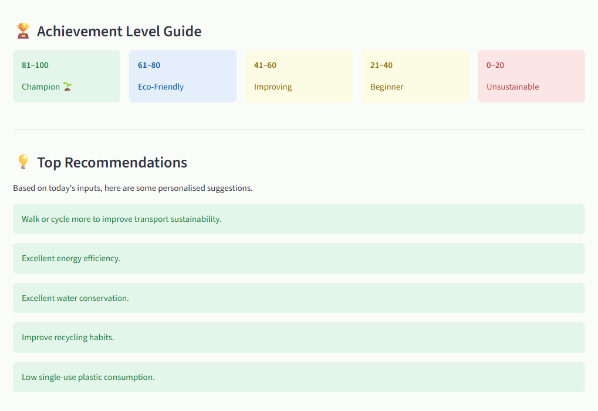
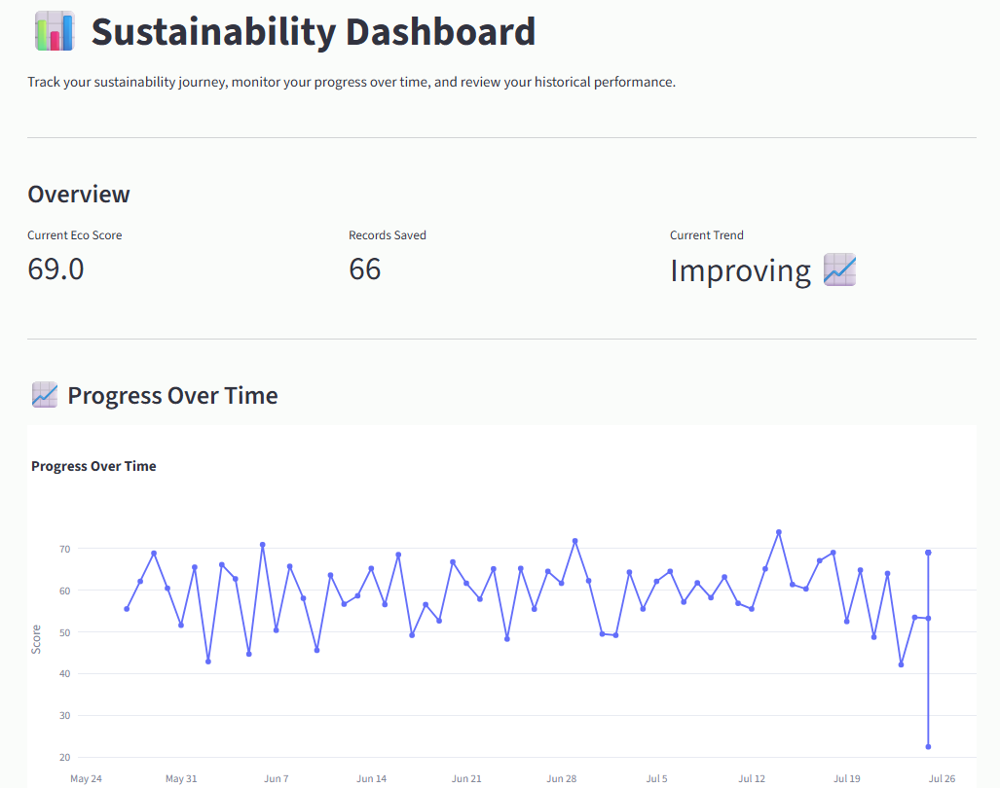

# 🌱 Sustainable Lifestyle Calculator

## Overview

The Sustainable Lifestyle Calculator is an interactive Streamlit application that helps users understand the environmental impact of their everyday lifestyle choices. By analysing transportation habits, household resource consumption and waste management practices, the application calculates an overall Eco Score and provides personalised recommendations for adopting more sustainable habits.

The application also stores historical records, allowing users to monitor their progress over time through interactive charts and dashboard analytics.

---

## Features

### Sustainability Assessment

- Calculate an overall Eco Score based on daily lifestyle habits
- Transportation sustainability assessment
- Electricity consumption evaluation
- Water consumption evaluation
- Recycling habit analysis
- Single-use plastic usage assessment
- Personalised sustainability recommendations

### Dashboard & Analytics

- Historical sustainability records
- Interactive Eco Score progress graph
- Weekly moving average
- Monthly moving average
- Goal tracking
- Weekly goal summary
- Sustainability trend analysis
- Latest assessment summary

### Additional Utilities

- Generate 60 days of sample sustainability data for testing dashboard features

---

## Technologies Used

- Python 3.13
- Streamlit
- Pandas
- Plotly
- CSV
- Object-Oriented Programming principles

---

## Project Structure

```
Sustainable_Lifestyle_Calculator/
│
├── app.py
├── calculator.py
├── data_manager.py
├── visualization.py
├── generate_sample_data.py
├── eco_scores.csv
├── requirements.txt
├── README.md
├── LICENSE
├── .gitignore
│
├── ui/
│   ├── intro.py
│   ├── input_page.py
│   ├── results.py
│   ├── dashboard.py
│   └── styles.py
│
└── Docs/
    ├── Project Specification.pdf
    ├── Version 1 Review.pdf
    └── Developer_Guide.md
```

---

## Installation

Clone the repository:

```bash
git clone <repository-url>
```

Navigate to the project folder:

```bash
cd Sustainable_Lifestyle_Calculator
```

Install the required dependencies:

```bash
pip install -r requirements.txt
```

Run the application:

```bash
streamlit run app.py
```

The application will automatically open in your default web browser.

---

## Before Running the Application

No additional setup is required before running the project.

The application does **not** require:

- API keys
- User accounts
- Internet connection
- External databases

All sustainability records are stored locally in the `eco_scores.csv` file.

---

## How to Use the Application

After launching the application, you will be guided through the following workflow.

### Step 1 – Home Page

The application opens on the **Intro** page.

From here you can:

- Start a new sustainability assessment.
- View the dashboard if previous records are available.

---

### Step 2 – Enter Sustainability Data

Complete the sustainability assessment by entering information about:

- Transportation habits
- Electricity usage
- Water consumption
- Recycling habits
- Single-use plastic usage

Click **Calculate Eco Score** to continue.

---

### Step 3 – Review Your Results

The Results page displays:

- Your overall Eco Score
- Achievement Level
- Category-wise sustainability scores
- Personalised recommendations
- Summary of today's inputs

You can choose to return to the Home page, calculate another Eco Score or open the Dashboard.

---

### Step 4 – Explore the Dashboard

The Dashboard allows you to monitor your sustainability progress over time.

It includes:

- Progress Over Time
- Weekly Moving Average
- Monthly Moving Average
- Goal Tracking
- Weekly Goal Summary
- Trend Analysis
- Historical Records
- Latest Entry Summary

---
## Screenshots from the Application

---

## Application Screenshots

The images below illustrate the main stages of the application workflow.

### 1. Home Page

Displays an introduction to the application and allows users to begin a sustainability assessment or access the dashboard.



---

### 2. Sustainability Input Page

Users enter their transportation, energy, water and waste management information before calculating their Eco Score.



---

### 3. Results Page

Displays the calculated Eco Score, achievement level, category scores and personalised sustainability recommendations.




---

### 4. Dashboard

Provides historical sustainability records, interactive charts, goal tracking and trend analysis.



## User Workflow

```
Intro Page
      ↓
Enter Sustainability Data
      ↓
View Results & Recommendations
      ↓
Explore Dashboard Analytics
```

---

## Sample Data

If you would like to explore the dashboard without manually entering multiple sustainability records, you can generate sample data.

Run:

```bash
python generate_sample_data.py
```

This generates **60 days of realistic sustainability data** and stores it in `eco_scores.csv`.

---

## Troubleshooting

### Dashboard is empty

This usually means that no sustainability records have been created yet.

**Solution**

- Complete your first sustainability assessment, or
- Generate sample data by running:

```bash
python generate_sample_data.py
```

---

### Missing Python packages

If you receive an error indicating that Streamlit, Pandas or Plotly cannot be found, install the required dependencies again:

```bash
pip install -r requirements.txt
```

---

### Application does not start

Make sure you are running the command from the project folder:

```bash
streamlit run app.py
```

Also verify that Python and Streamlit are installed correctly.

---

## Current Limitations

The current version of the application has a few known limitations.

- Sustainability records are stored locally in a CSV file instead of a database.
- The application currently supports one user at a time.
- Sustainability scores are calculated using predefined assumptions and are intended for educational purposes rather than as an official environmental assessment.

---

## Documentation

This repository contains two levels of documentation.

- **README.md** — End-user guide containing installation instructions and application usage.
- **Docs/Developer_Guide.md** — Technical documentation covering project architecture, implementation details and maintenance for developers.

---

## Author

**Sanika Halale**

---

## License

This project is released under the MIT License.